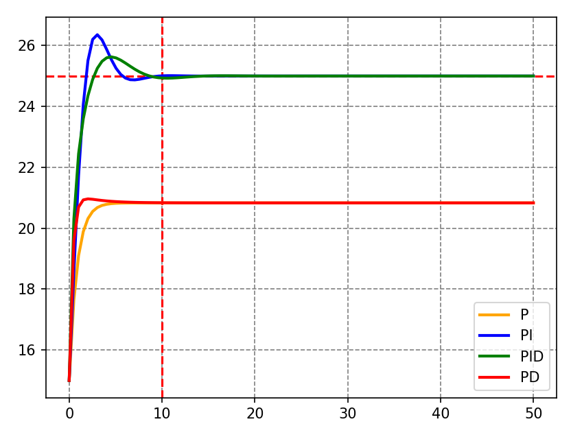
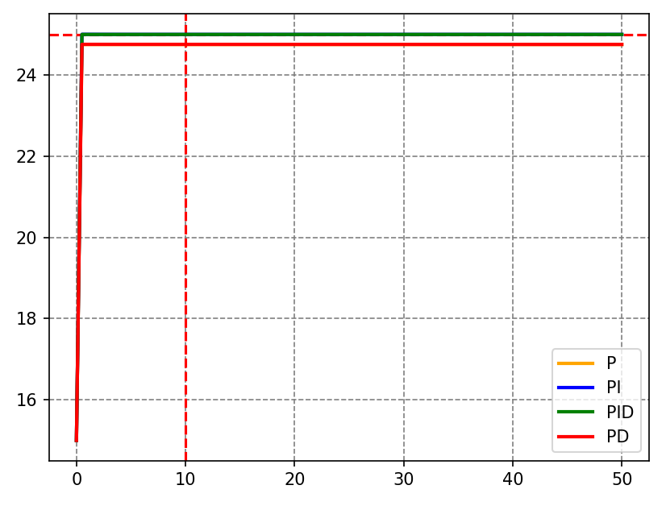
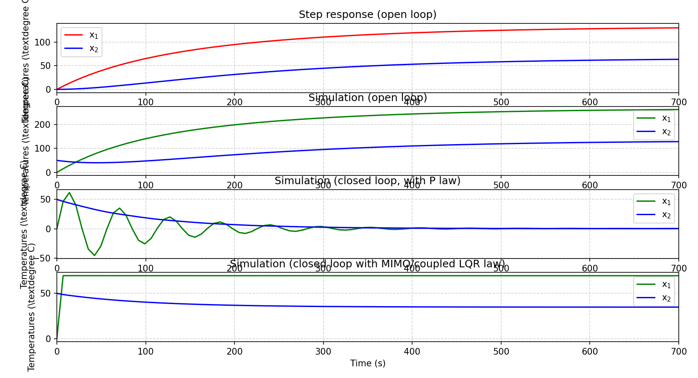

# Group: Henrique Gundlach and Lara Polachini
## Contrôle optimal et systèmes hybrides - WS 2
---

# Question 1

### (a) Gradually enhance your P controller towards a SISO PID controller.

Done in class

### (b) and (c) Comparison of controls and parameters modifications

The results of all the controllers (P, PD, PI and PID) are shown in the figure:

The figure shows the responses of the P, PD, PI, and PID controllers. As expected, the P and PD controllers stabilize below the desired temperature (25 °C). This happens because neither P nor PD contains integral action, so they cannot eliminate the steady-state error. In contrast, the PI and PID controllers reach the correct setpoint, although with different overshoot and settling times due to the different contributions of integral and derivative terms.

We modified the parameters considering that: Kp controls the speed in which the system gets stable; Kd controls the variance in error, avois oscilations; Ki adapts to the correct point. Making progressive corrections, the figure below shows the responses of all four controllers (P, PI, PD, and PID) using the tuned parameters (Kp = 20, Ti = 0.1, Td = 15). With these values, the controllers exhibit significantly improved behavior compared to the initial tests.

As expected, the P and PD controllers still stabilize slightly below the setpoint. This happens because neither controller includes an integral term, so a small steady-state error always remains in systems of this type. However, the high Kp and large static gain, the residual error becomes very smaller.

---

# Question 2

The script begins by defining the physical parameters of the heated-tanks model (a1, a2, b1, b2), the controller settings (kp1, kp2, etc.), the initial temperatures x0 = [0, 50], and the simulation interval from t0 to tfin. These serve as the inputs to the model. With these values, the code builds a 2-state state-space representation modeL1 capturing the temperature dynamics of the two coupled tanks. It first evaluates the open-loop step response of this model and simulates the temperatures when both heaters receive constant inputs (h1 = h2 = 2). Next, two proportional controllers are created using transfer functions P1 and P2, combined into a MIMO P-controller with ct.append. A closed-loop system is then formed using unity feedback, and its response to a reference signal w = [70, 30]ᵀ is simulated. Finally, the script designs an LQR controller by selecting weighting matrices Qx and Ru, computing the optimal gain K, and simulating the resulting state-feedback closed-loop system.

The expected output is four subplots that show how the tank temperatures evolve under different scenarios. The first subplot displays the open-loop step response, highlighting how each tank’s temperature responds independently to a step in the heater input. The second subplot shows the open-loop simulation under constant heating, revealing the natural slow warming dynamics and inter-tank coupling. The third subplot presents the closed-loop behaviour under proportional control, where the temperatures attempt to track the reference values but exhibit oscillations. The final subplot shows the closed-loop LQR response, where the optimised state-feedback controller drives both tanks smoothly toward the desired temperatures.

Together, these plots match the expected behaviour for the heated-tanks system under the given control strategies. The open-loop results confirm that the system is inherently slow and coupled, making precise temperature regulation difficult without feedback. The proportional controller improves tracking but introduces oscillatory behaviour due to its limited ability to manage the interdependence between the tanks. In contrast, the LQR controller delivers the expected superior performance: smooth, fast, and stable convergence to the reference temperatures. This demonstrates how multivariable optimal control more effectively handles the coupling and dynamics of the two-tank system.

